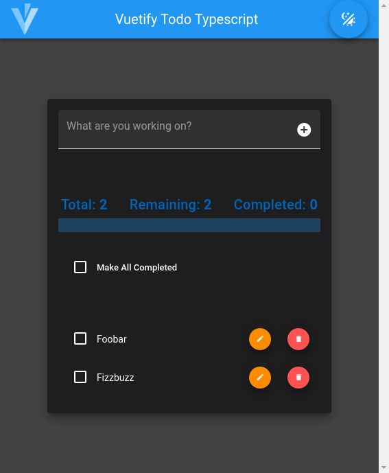

# Vuetify Todo Typescript

## About

A basic TODO app built with Vue, Vuetifyjs, Typescript

## Demo

[Live demo](https://vuetify-todo-typescript.netlify.app/)

## Preview



## Project setup

```
yarn install
```

### Compiles and hot-reloads for development

```
yarn serve
```

### Compiles and minifies for production

```
yarn build
```

### Lints and fixes files

```
yarn lint
```

### Customize configuration

See [Configuration Reference](https://cli.vuejs.org/config/).

## LICENSE

[MIT](./LICENSE)
